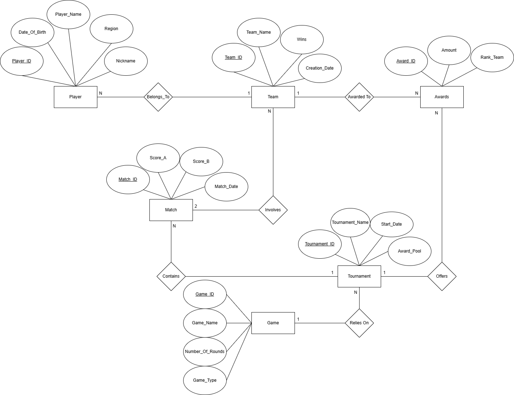

# 🎮 E-Sports Tournament Management System

## 📌 Project Overview
This project is a **relational database system** designed to manage and organize E-Sports tournaments efficiently.  
It simulates a real-world competitive gaming environment where teams, players, matches, and tournaments are interconnected.

The system ensures **data integrity, consistency, and automation** using advanced database concepts such as:
- Foreign Keys
- Constraints
- Triggers
- Views
- Stored Procedures

---

## 🎯 Objectives
The main goals of this project are:
- Manage teams and players in competitive gaming
- Organize tournaments across different games
- Track match results using Best-of-N rules
- Distribute tournament prizes fairly
- Generate meaningful reports for analysis

---

## 🧠 Key Features
- ✅ Structured relational database design (normalized)
- ✅ Automatic validation of match results using triggers
- ✅ Prevention of invalid data entry (constraints & checks)
- ✅ Dynamic calculation of match winners
- ✅ Organized reporting system using SQL queries
- ✅ Scalable design for future enhancements

---

## 🏗️ Database Structure

### Main Entities:
- **Teams** → Stores team information  
- **Players** → Stores player details linked to teams  
- **Games** → Defines game types and match rules  
- **Tournaments** → Represents competitions  
- **Matches** → Stores match results  
- **Awards** → Handles prize distribution  

---

## 🔗 Relationships
- One Team → Many Players  
- One Game → Many Tournaments  
- One Tournament → Many Matches  
- One Match → Two Teams  
- One Tournament → Many Awards  

---

## ⚙️ Advanced Features

### 🔹 Triggers
- Validate match results based on **Best-of-N rules**
- Ensure the winner matches the actual score
- Prevent invalid match entries

### 🔹 Constraints
- Prevent duplicate entries  
- Ensure valid scores and data ranges  
- Maintain referential integrity  

### 🔹 Views
- Simplified match reporting using `Match_Details`

### 🔹 Stored Procedures
- Retrieve tournament winners dynamically

---

## 📊 Sample Reports
- Matches Summary Report  
- Tournament Awards Distribution  
- Players by Team  
- Team Rankings based on wins  

---

## 🚀 Technologies Used
- MySQL  
- SQL (DDL, DML, DCL)  
- Database Design (ERD)  

---

## 📁 Project Structure
```
E-Sports-Tournament-System/
│── README.md
│── database.sql
│── ERD.drawio
│── docs/
│   └── project_details.pdf
```

---
## 🗺️ Entity Relationship Diagram (ERD)

This diagram represents the structure of the database and the relationships between entities.



---
## 📌 Future Enhancements
- Add player statistics tracking  
- Implement ranking system (ELO/MMR)  
- Build a web interface for interaction  
- Add real-time match updates  

---

## 👨‍💻 Author
- Abdulrahman Ageeli 

---

## 📄 License
This project is for academic purposes.
